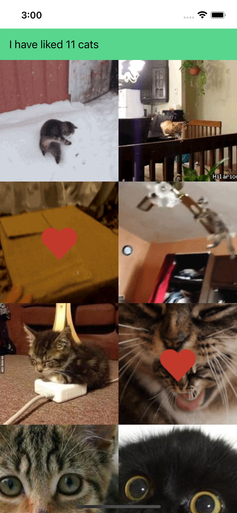

## Assignment

The assignment is to build a very small app that loads cat images from an API and displays them in an **infinitely scrollable** list. The user must be able to "like" and "unlike" the images and a global counter must display the number of `likes`.

Expected end result:

### Technical requirements:

You should use react-native and typescript (you can use the default typescript template when creating your project: `npx react-native init AwesomeTSProject --template react-native-template-typescript`)

Use the free `Cat as a service` API: https://cataas.com/

You should use the `/api/cats?skip=0&limit=25` endpoint to fetch paginated data.

You should implement infinite loading such as whenever the user scrolls to the end of the page, the next page should be fetched.

You must be able to like/unlike  a picture by tapping/un-tapping it and display a counter.

Hint: the returned data is an object array, each object has an `id` field. With that id you can compose url to fetch the image, but you should not include a file extension for example: `https://cataas.com/cat/${id}?height=200`.

You may use any existing open source package you want, try to reduce the number of re-renders to the strict minimum. You may add caching for extra points.

### Submission
Your submit all the source code and instructions on how to run it. You may share it via a git repo or a .zip archive. However do not share it publicly ! You will be assessed both on the quality of the code as well as the performance and functionality of the app. 

Only the IOS will be run, so no need to focus on optimizing styling across android devices.